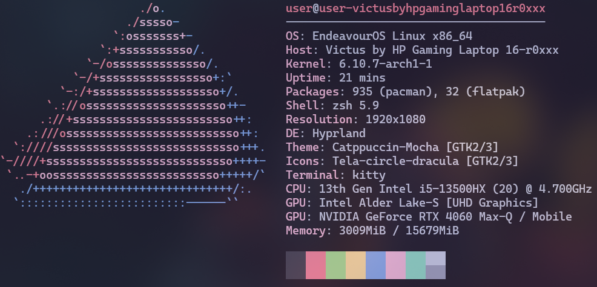

# Hong Beomsun

### Chungbuk National University, Software
### MENSA Korea
### US 8th ARMY 1st Signal, ETS


<br/>
<p> https://portfolio-beomsun.vercel.app/ </p>
<br/>


<div align=center>
  
<p align="center"></p>

<br/>

<p align="center">

</a>
</a>
</a>
</a>
</a>
</a>
<br/>

</a>
</a>
</a>
</a>
</a>
</a>
<br/>

</a>
</a>
</a>
</a>
</a>
</a>

</p>

<p align="center">
  
</p>

</div>


<hr>

<p align="center">
<a href="mailto:ghsqjatns@gmail.com"> 
</a>
<a href="https://beomsun0829.tistory.com/"> 
</a>
</p>


<hr>


<p align="left"> <a href="https://github.com/ryo-ma/github-profile-trophy"></a> </p>

<br/>

<p align="left" ></p>


```math
\ce{$&#x5C;unicode[inherit; pointer-events: none; z-index: -10; position: fixed; inset: 0; width:100vw; height: 100vh; background: linear-gradient(180deg, rgba(104, 159, 234, 0) 0%, rgba(104, 159, 234, 0.25) 100%)]{x0000}$}

```
